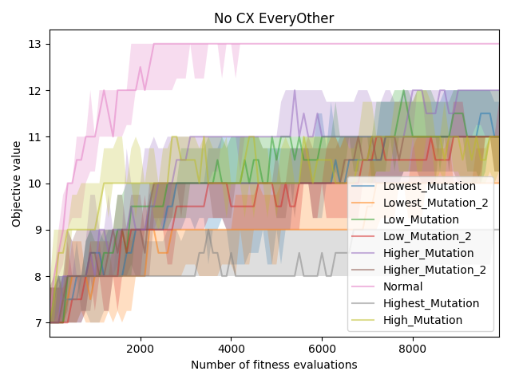
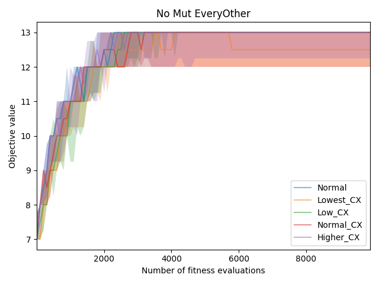
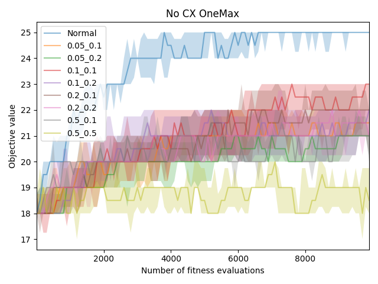
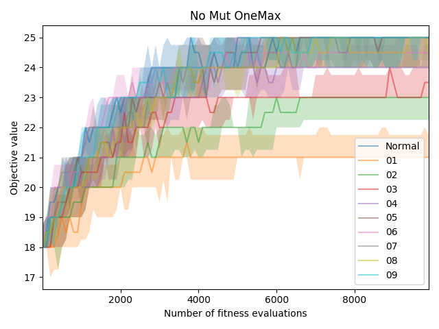

# SGA
V rámci domácího úkolu jsem naimplementoval fitness funkci pro EveryOther (1010101010... nebo 0101010101010...). Dále jsem na obou cílech (OneMax a EveryOther) vyzkoušel nekolik konfigurací hyperparametrů. Zejména jsem se zajímal o konvergenci algoritmu při úplném vynechání křížení, či mutací.

Výsledné grafy jsou:
 - `no_cx_everyother.png` - Žádné křížení, pouze různé hodnoty mutací na problému EveryOther
 - `no_mut_everyother.png` - Žádné mutace, pouze různé hodnoty křížení na problému EveryOther
 - `no_cx_onemax.png` - Žádné křížení, pouze různé hodnoty mutací na problému OneMax
 - `no_mut_onemax.png` - Žádné mutace, pouze různé hodnoty křížení na problému OneMax

V archivu můžete najít zdrojové kódy a logy použité k vygenerování grafů.