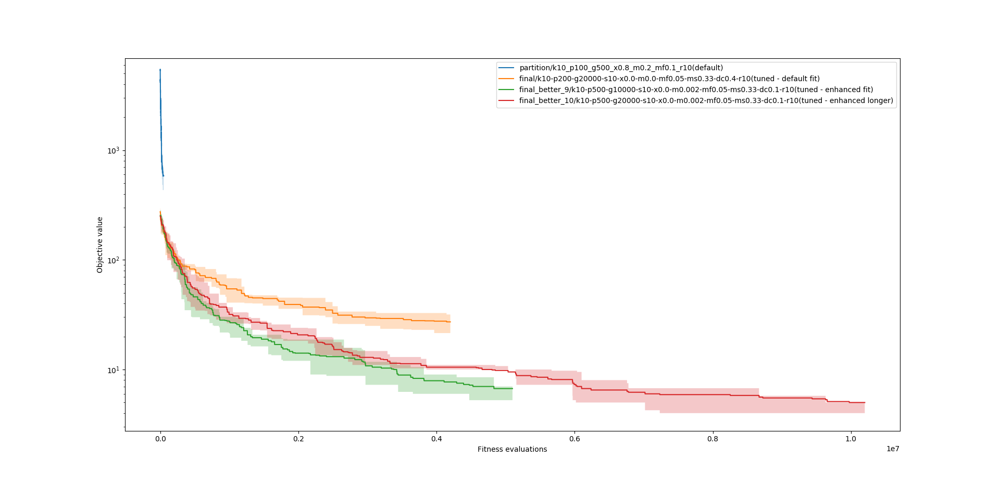

# SP1
V rámci domácího úkolu jsem upravil soubor `partition.py` následujícím způsobem:

 - Z každé generace přežívá `SURVIVES` (já použil hodnotu `10`) nejlepších jedinců do další generace (tedy velikost populace v 2.-... generaci je `POP_SIZE+SURVIVES` jedinců)
 - Křížení jsem zakázal
 - Vztvořil jsem novou mutaci `divide_and_conquer`, která vezme s pravděpodobností `DIV_CON_PROB` nejlehčí a nejtěžší hromádku, spojí je a znovu rozdělí, co nejspravedlivěji
 - Vytvořil jsem novou mutaci `switch_mutate` (pravděpodobnost aplikace `MUT_PROB_2`), která s pravděpodobností MUT_SWITCH_PROB přenese předmět z nejtěžší hromádky na nejlehčí
 - Vytvořil jsem novou fitness funkci `better_fitness` = $(\sum_(i=0)^N((mean-weight_i)^2))^(1/N)$

Poté jsem vyzkoušel několik běhů s různými parametry. Nejlepší výsledek jakého se mi podařilo dosáhnout je rozdíl **_2_**. Bohužel se mi nepodařilo najít optimum. Pravděpodobně jsem měl spustit výpočty na více generacích nebo vyzkoušet ještě další mutace nebo parametry.

Grafy výsledků:

Parametry v názvu souboru:
|zkratka|význam|
|--:|:--|
|k|počet hromádek|
|p|velikost populace|
|g|maximální generace|
|s|počet přeživších z minulé generace|
|x|pravděpodobnost křížení|
|m|pravděpodobnost klasické mutace|
|m2|pravděpodobnost switch mutace (zapomněl jsem)|
|mf|pravděpodobnost přehození předmětu|
|ms|pravděpodobnost výměny předmětu|
|dc|pravděpodobnost divide&conquer mutace|
|r|počet opakování|