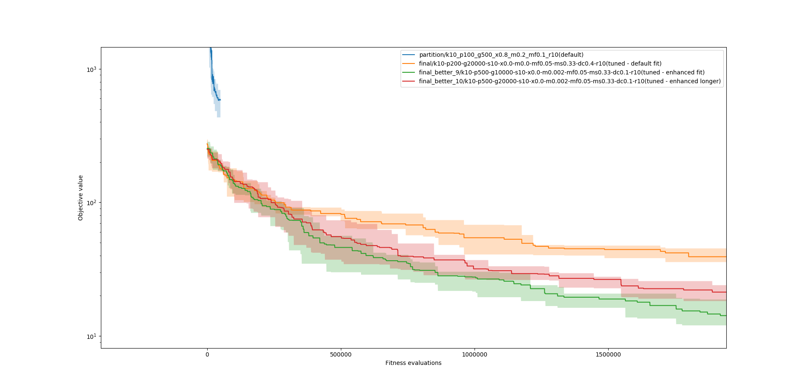

# SP1
V rámci domácího úkolu jsem upravil soubor `partition.py` následujícím způsobem:

 - Z každé generace přežívá `SURVIVES` (já použil hodnotu `10`) nejlepších jedinců do další generace (tedy velikost populace v 2.-... generaci je `POP_SIZE+SURVIVES` jedinců)
 - Křížení jsem zakázal
 - Vztvořil jsem novou mutaci `divide_and_conquer`, která vezme s pravděpodobností `DIV_CON_PROB` nejlehčí a nejtěžší hromádku, spojí je a znovu rozdělí, co nejspravedlivěji
 - Vytvořil jsem novou mutaci `switch_mutate` (pravděpodobnost aplikace `MUT_PROB_2`), která s pravděpodobností MUT_SWITCH_PROB přenese předmět z nejtěžší hromádky na nejlehčí
 - Vytvořil jsem novou fitness funkci `better_fitness`

$$(\sum_(i=0)^N((mean-weight_i)^2))^(1/N)$$

Poté jsem vyzkoušel několik běhů s různými parametry. Nejlepší výsledek jakého se mi podařilo dosáhnout je rozdíl **_0_**.

Nastavení:
```python
K = 10  # number of piles
POP_SIZE = 800  # population size
MAX_GEN = 20000 # maximum number of generations
CX_PROB = 0.0  # crossover probability
DIV_CON_PROB = 0.05 # probability of divide and conquer mutation
MUT_PROB = 0.001  # mutation probability (flip)
MUT_PROB_2 = 0.05  # mutation probability (switch)
MUT_FLIP_PROB = 0.02  # probability of chaninging value during mutation
MUT_SWITCH_PROB = 0.15  # probability of chaninging value during mutation
REPEATS = 10  # number of runs of algorithm (should be at least 10)
SURVIVES = 10 # number of survivors
OUT_DIR = 'final_better_11'  # output directory for logs
# the ID of this experiment (used to create log names)
EXP_ID = 'k{}-p{}-g{}-s{}-x{}-m{}-mf{}-ms{}-dc{}-r{}(tuned)'.format(
    K, POP_SIZE, MAX_GEN, SURVIVES, CX_PROB, MUT_PROB, MUT_FLIP_PROB, MUT_SWITCH_PROB, DIV_CON_PROB, REPEATS)
```

Grafy výsledků:



Parametry v názvu souboru:

| zkratka | význam                                        |
| ------: | :-------------------------------------------- |
|       k | počet hromádek                                |
|       p | velikost populace                             |
|       g | maximální generace                            |
|       s | počet přeživších z minulé generace            |
|       x | pravděpodobnost křížení                       |
|       m | pravděpodobnost klasické mutace               |
|      m2 | pravděpodobnost switch mutace (zapomněl jsem) |
|      mf | pravděpodobnost přehození předmětu            |
|      ms | pravděpodobnost výměny předmětu               |
|      dc | pravděpodobnost divide&conquer mutace         |
|       r | počet opakování                               |

Bohužel jsem nestihl nechat dopočítat finální řešení s optimálním výsledkem. Proto není součástí grafu a je pouze přiloženo v .zip souboru.