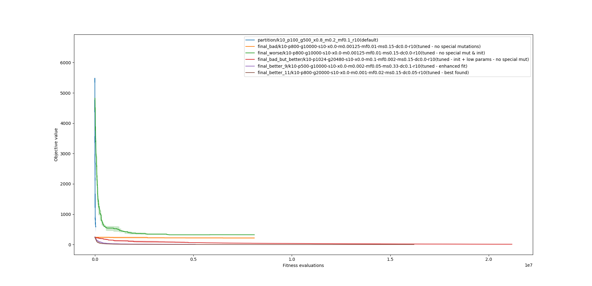
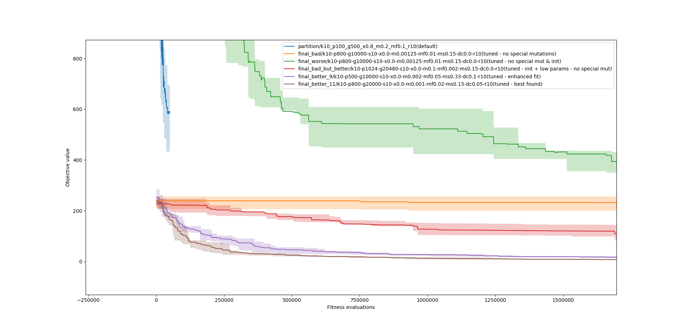

# SP2
Při řešení minul0ho domácího úkolu (viz README.md v .zip souboru) jsem již
implementoval pokročilejší operaátory a použil je, jelikož jsem si popletl
zadání. V rámci tohoto domácího úkolu jsem tedy spustil několik běhů bez
pokročilých mutací, abych měl s čím srovnávat.

V grafech můžete vidět nejlepší dopočítané řešení z minule; ještě lepší řešení
s pokročilými mutacemi, které se dostalo na 0; defaultní řešení a mnou nyní
dopočítaná 3 řešení.

Řešení 1 nepoužívá žádné vylepšené mutace, křížení, inicializace, ani nic
podobného. Má pouze aktualizované parametry zaručující lepší konvergenci.

Řešení 2 používá navíc chytrou inicializaci. Můžeme pozorovat, že bez chytrých
mutací se řešení v podstatě nezlepšuje.

Řešení 3 má mnohem nižší parametry křížení a běželo dýl. Nepoužilo žádné
chytré mutace, ale použilo inteligentní inicializaci. V 6. běhu se podařilo
klesnout s objektivní funkcí na `0` (viz final_bad_but_better složku).

Grafy výsledků:

Parametry v názvu souboru:

| zkratka | význam                                        |
| ------: | :-------------------------------------------- |
|       k | počet hromádek                                |
|       p | velikost populace                             |
|       g | maximální generace                            |
|       s | počet přeživších z minulé generace            |
|       x | pravděpodobnost křížení                       |
|       m | pravděpodobnost klasické mutace               |
|      m2 | pravděpodobnost switch mutace (zapomněl jsem) |
|      mf | pravděpodobnost přehození předmětu            |
|      ms | pravděpodobnost výměny předmětu               |
|      dc | pravděpodobnost divide&conquer mutace         |
|       r | počet opakování                               |
