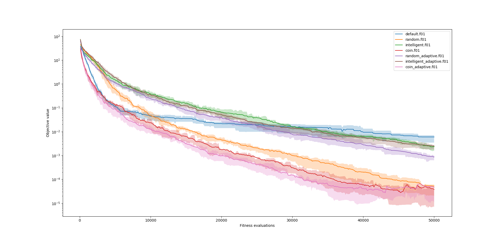
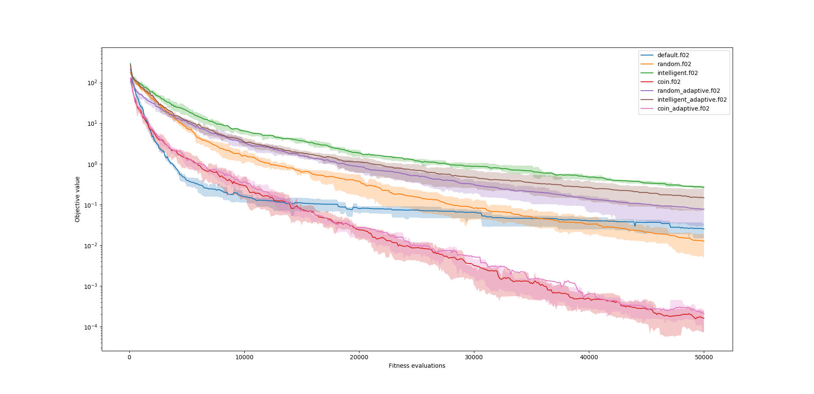
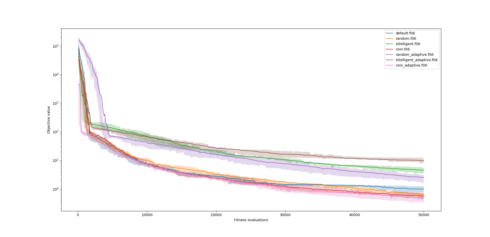
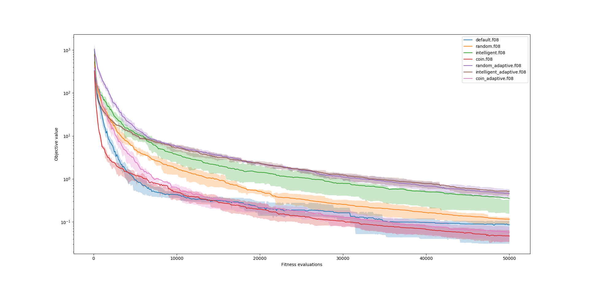
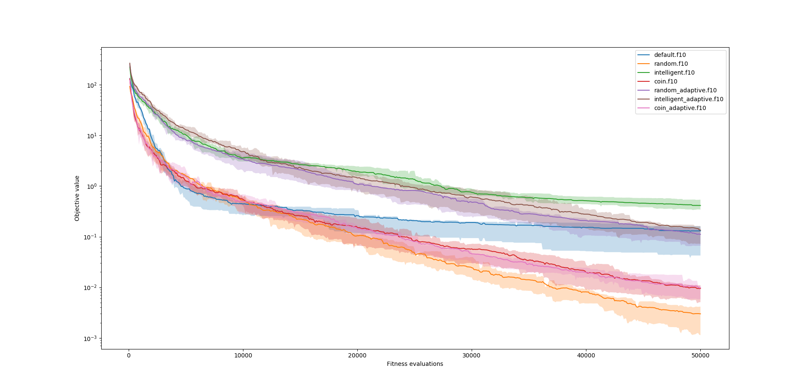

# Continuous Optimization 1

## Operátory
V rámci domácího úkolu jsem implementoval následující operátory:

### 1. random
Vážené aritmetické křížení pomocí náhodného parametru. Tedy při křížení vznikají
dva jedinci:

$$ w = randf() $$
$$ a = p1 * w + p2 * (1 - w) $$
$$ b = p2 * w + p1 * (1 - w) $$

### 2. intelligent
Opět vážené aritmetické křížení, ale vztažené k fitness funkci jedinců:

$$ w = p1.fitness / (p1.fitness + p2.fitness) $$
$$ a = p1 * w + p2 * (1 - w) $$
$$ b = p2 * w + p1 * (1 - w) $$

### 3. coin
Křížení náhodným výberem parametru z každého jedince. Tedy u každého genu si
hodím mincí, zda použiji gen z p1 a nebo gen z p2.

$$ w = random_vector(len(p1)) $$
$$ a = p1 * w + p2 * (1 - w) $$
$$ b = p2 * w + p1 * (1 - w) $$

### 4. adaptive
Pro každý parametr z jedince přidám proměnnou reprezentující varianci, která má
být použitá při mutaci parametru. Tyto variance jsou poté mutováný pomocí
předdefinovaného parametru `ADAPTIVE_VAR` (použil jsem hodnotu 0.5).

## Výsledky

Při svých výpočtech jsem neměnil parametry, ale pouze operátory.

### 01 - Koule

Z grafu můžeme vidět, že všechny mnou implementované operátory a jejich kombinace si vedou lépe, než defaultní nastavení. Některým to ovšem trvá déle. Zejména aritmetická křížení si vedou zřetelně hůře než `coin` křížení.

To bych přisoudil tomu, že při aritmetickém průměru dvou jedinců vytvořím jedince někde mezi nimi. Tedy mi opravdu pomůže zejména to, když se vybraní jedinci nachází naproti sobě, křížem přes kouli, a jejich průměr skončí někde blíže centru koule a tedy optimu. Tato situace je ovšem ne příliš pravděpodobná. U `coin` křížení vznikají dva jedinci v rozích konvexního obalu určeným předky a tedy je jejich pozice více nahodilá v prostoru a tím napomáhá exploraci. Čemuž přisuzuji rychlejší konvergenci. Navíc se pohybuji podél souřadnicových os.

Adaptivní mutace při této funkci neudělala příliš velký rozdíl. V případě `coin` křížení zrychlila konvergenci, ale nijak významně. V kombinaci s `random` křížením naopak příliš zpomalila konvergenci. Přiznám se, že tady si důvod úplně neodvažuji určit. Obě funkce začínají stejně, ale pak dojde ke zlomu okolo objektivu `1` a adaptivní varianta konverguje asi 2x pomaleji. Tipl bych si, že adaptivní verze příliš "uklidnila" a nebo naopak "rozvířila" mutace a konvergenci tedy naopak zhoršila. Podivuhodné pak ale je, že se to nedotklo `coin` křížení. `intelligent` křížení si vedlo špatně od začátku a adaptivní mutace na něj neměla skoro vliv. Každopádně v obou variantách nakonec překonalo `default` a z grafu není patrné, že by klesající tendence zpomalovala. Kdybychom zvýšili počet epizod, pravděpodobně by se výsledky přiblížily i ostatním variantám.

### 02 - Ellipsoidal

Na obrázku pozorujeme v podstatě totéž, co u koule, ale ještě ve větším měřítku. V tomto případě adaptivní parametry konvergenci `coin` varianty nijak neuspíšily. Ovšem můžeme pozorovat lepší konvergenci adaptivní `intelligent` varianty.

### 06 - Attractive Sector

Při této funkci můžeme pozorovat velice rychlou počátační konvergenci. Nejlépe si vede adaptivní `coin` varianta a nejhůře adaptivní `random` varianta. Poté, co funkce začnou konvergovat, většina z nich splyne až na oboje `intelligent` a adaptivní `random` varianty, které konvergují znatelně pomaleji a nepovede se jim překonat `default`. `intelligent` si vedou takto špatně zejména proto, že při křížení vznikají jedinci, kteří zákonitě nejsou lepší než nejlepší z rodiců. Stejné chování bych očekával od `random` varianty, ale z nějakého důvodu to ovlivnilo pouze adaptivní verzi. Je možné, že `random` variantě hraje do karet náhoda váhy. Tím, že není váha křížení daná pevně podle fitness, se pravděpodobně vyhneme lokálním optimum.

### 08 - Rosenbrock

U Rosenbrock funkce pozorujeme, že už žádná z aritmetických verzí nezvládá konvergenci. `random` varianta si z nich ovšem stále vede nejlépe. `coin` varianta má velmi rychlou konvergenci zezačátku a poté postupně klesá, až kolem 15000. generace překoná `default`. Adaptivní variantě to trvá o trochu déle a zezačátku konverguje pomaleji, ale drží se svým protějškem stejný kurz.

Ukazuje se, že aritmetické křížení má problémy vyrovnat se s plochami a má tendenci uvíznout v lokalních optimech. 

### 10 - Rotated Ellipsoidal

U otočeného elispoidu pozorujeme podobné tendence jako u 02. 

Znatelné rozdíly jsou 3:
 1. `default` konverguje krapet pomaleji
 2. základní `random` varianta konverguje rychleji
 3. `coin` varianty konvergují mnohem pomaleji

Pozorování 1 může být čistě náhodné, ale řekl bych, že jednobodové křížení by mohlo trochu zpomalit konvergenci.

U pozorování 2 si také nejsem úplně jistý, čím může být, že `random` konverguje o tolik lépe, řekl bych, ale, že v tom bude mít prsty úvodní inicializace populace, kde optimum leží na diagonále iniciálně pokrytého prostoru a tedy je větší šance, že nageneruji jedince "na druhé straně" eliposidu.

Pozorování 3 si vysvětlují tím, že `coin` strategie produkuje jedince v rozích konvexního obalu, kolem vybraných rodičů, podél souřadnicových os. Jelikož je ale optimum na rotované funkci, toto křížení mi příliš nepomáhá. Vylepšení by mohlo být zkombinovat `coin` s `random` variantou a generovat jedince "zevnitř" tohoto obalu.