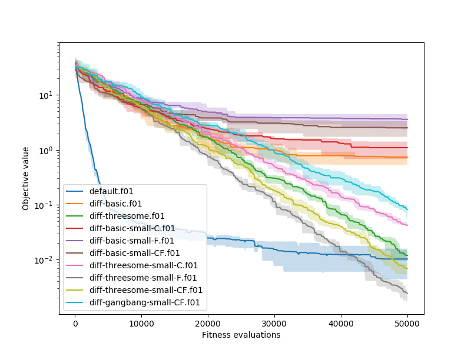
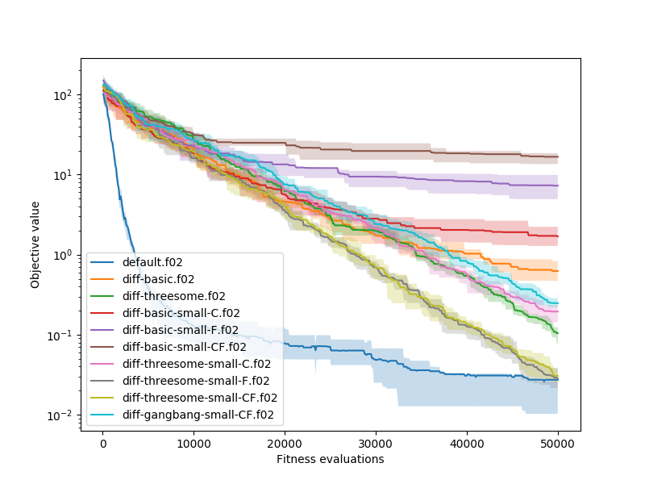
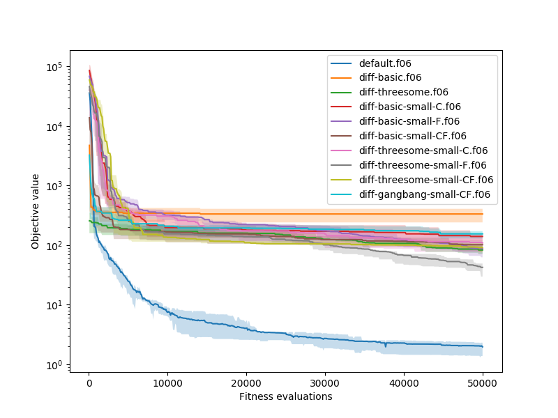
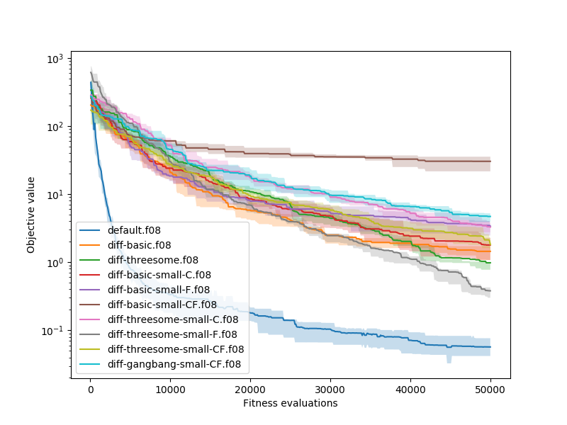
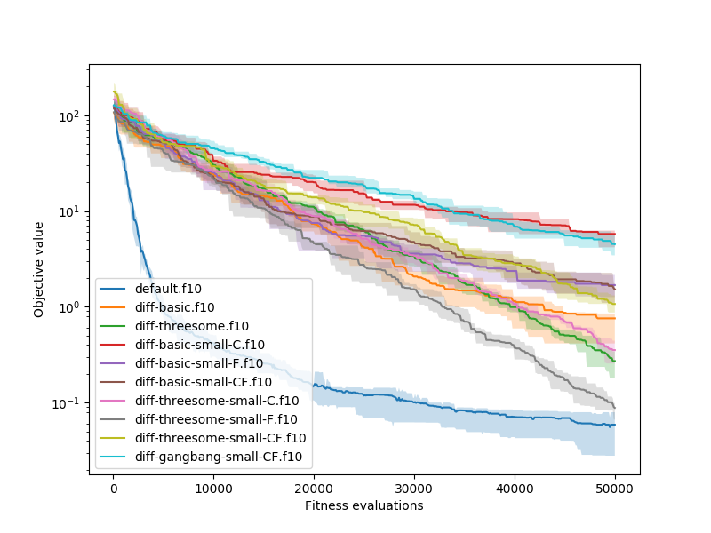
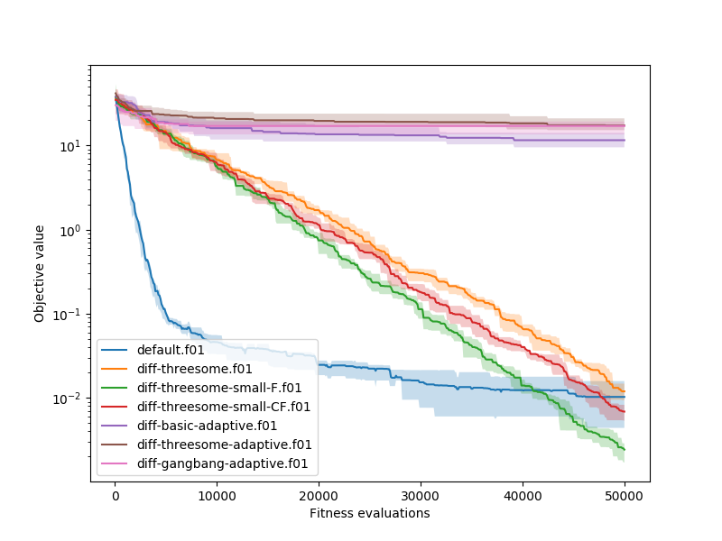
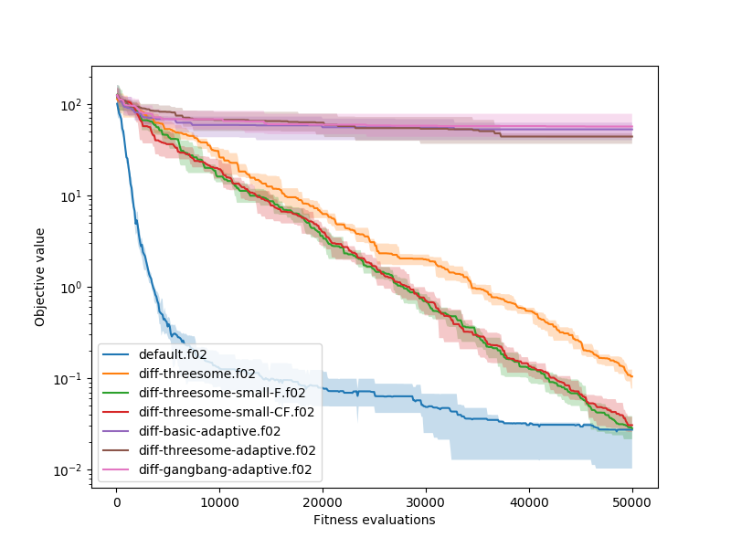
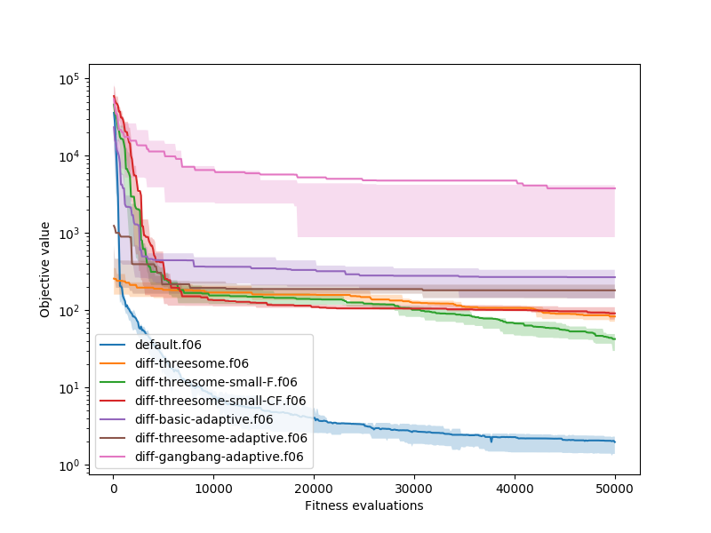
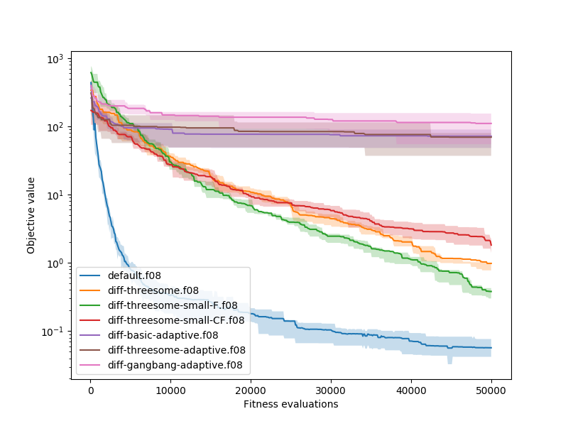
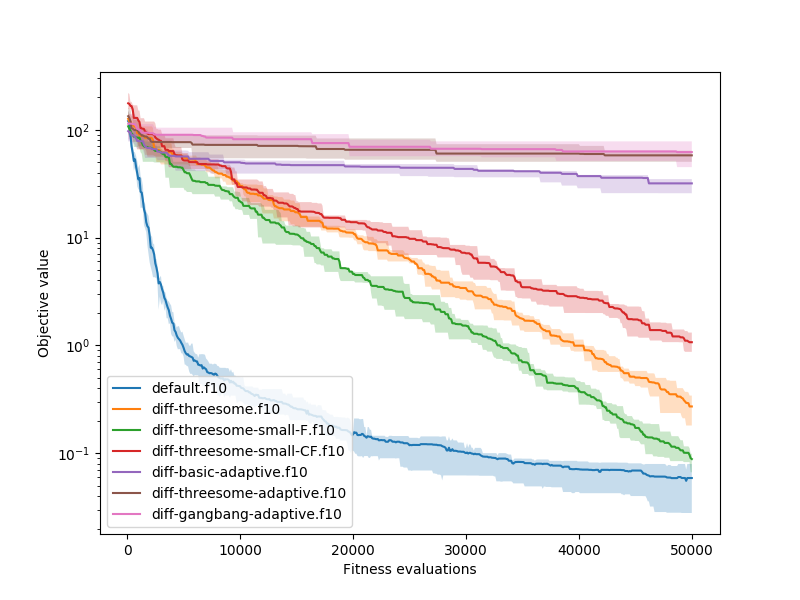

# Params:
C: 0.5 or 0.2

F: 1.5 or 1.2

|      Type | Partners |
| --------: | :------- |
|     basic | 2        |
| threesome | 3        |
|  gangbang | 5        |

## Results:
<table>
<tf>
<td></td>
<td></td>
</tr>
<tr>
<td></td>
<td></td>
</tr>
<tr>
<td></td>
</tr>
</table>

# Adaptive:
Parametry C a F jsou navoleny nahodne (z intervalu (0;1) a (0;2)) pri vytvoreni individua a pote krizeny spolu se zbylymi hodnotami pomoci diferencialni techniky.

Vysledky se neosvedcily viz:
<table>
<tf>
<td></td>
<td></td>
</tr>
<tr>
<td></td>
<td></td>
</tr>
<tr>
<td></td>
</tr>
</table>

Vysledky si vysvetluji tim, ze C a F parametry jsou vice citlive a nepromitaji se do fitness jedince. Z toho duvodu se pote spatne evolvuji. Mohlo by pomoci, kdybych evolvoval parametry jinak nez diferencialne.

Mohl bych vzit parametry rodice a pouzit na ne klasickou mutaci za pomoci prednastavene variace tak, jako jsme to delali v minulych prikladech.

Jeste lepsi mi ale prijde evolvovat C a F jako hyperparametry. Mohl bych spustit vicero simulaci a pote "nad nimi" evolvovat C a F. Kazda simulace by se tedy chovala jako jedinec definovany parametry (C1, F1) a napriklad nejlepsi jedinec z celeho behu by tento beh zastupoval. Jeho fitness bych povazoval za fitness jedince (C1; F1). Takto bych mohl hyperparametry klasicky evolvovat a najit ty nejlepsi, ktere by mi pomohly dosahnout nejlepsich vysledku. Ovsem evoluce by trvala dele, ale mohlo by stacit ji pustit na napriklad 50 generacich a pote az ty nejlepsi parametry pustit na celych 500.

Alternativne pokud bych chtel mit C a F dynamicky se menici v zavislosti na dane situaci v populaci, mohl bych mit nekolik globalnich C1...CN a F1...FN a pro ne zastupne jedince v populaci. Pote bych mohl tyto parametry evolvovat mezi sebou v zavislosti na vysledkach jedincu. Takto by se mel snizit chaos v krizeni, kterym evoluce momentalne trpi.